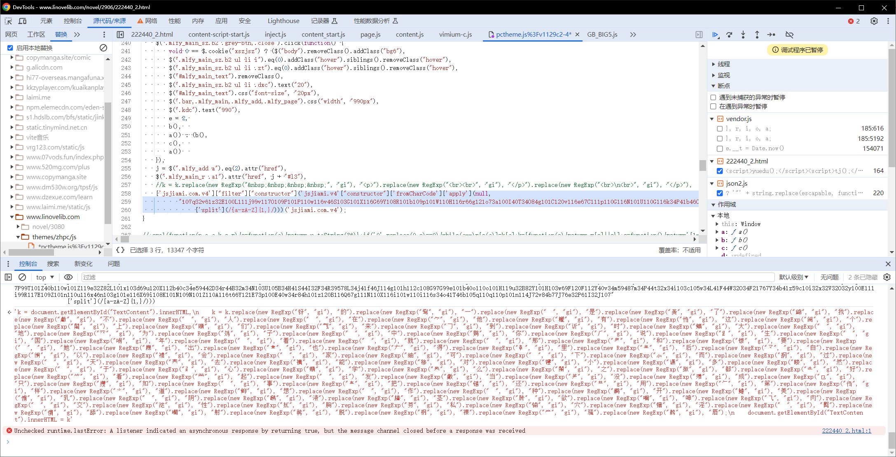

# Bilinoval_DL

## 哔哩轻小说下载器

是一个 [哔哩轻小说](https://www.linovelib.com/) 的小说下载器

- 可自行选择卷下载
- 自动打包为epub
- 可视化进度条

### TODO

- [x] 完善字体混淆表
- [ ] 小说进度跟踪(目前没有账号)
- [ ] 优化epub章节显示
- [x] 字库加密解密

### Q&A

- Q: 为什么运行速度慢

  A: 因为网站有一秒访问限制 无解

### 逆向

- 在`pctheme.js`获取完整字体混淆表 <mark>混淆表贴在最后</mark> (
  网页端又换加密了,代码混淆太恶心了,不搞js逆向了,投入自动化怀抱了)

  

- `5月2日` 加密有更新了，目前失效中，有一段文字混淆我不会解。。。我已经询问其他大佬
- `5月7日`
  字库加密已经解决了,采取这位大佬的 [ocr不讲武德解密法](https://github.com/lightnovel-center/linovelib2epub/blob/main/docs-internal/linovelib-pc-font-obfuscation.md)

### 更新日志

#### 0507#7

- 使用 `DrissionPage` 同步获取话章节与内容 优化以前先获取所有章节信息在获取内容的形式
- 采用ocr方式破解字库加密
  思路由 [ocr不讲武德解密法](https://github.com/lightnovel-center/linovelib2epub/blob/main/docs-internal/linovelib-pc-font-obfuscation.md)
  提供

#### 0411#6

- 增加获取章节触发访问限制重试
- 获取文本接口改回pc端
- 获取文章文字改为使用`DrissionPage`自动化库（速度还变快了
- 图片下载使用`DownloadKit`库,也是↑这位大佬的

#### 0401#5

- 小说章节字数统计(单位自动转换)
- 获取小说文本接口修改为移动端
- 优化获取图片逻辑
- 优化获取文本逻辑

#### 0331#4

- 经过网页js逆向获得完整字体混淆表
- 小说获取章节时输出章节名称提示
- 小说解析完毕后将目录文件保存为json
- 增加配置文件,供选择下载路径等
- 优化运行逻辑 提前创建需要文件夹
- 优化获取图片逻辑为(jpg|png)

#### 0310#3

- 修改用户交互为输入开始章与结束章地址
- 增加api方法
- 增加异常捕获

#### 0305#2

- 优化文件存放位置
- 修改获取章名与章链接方式为每章获取 (因为catalog界面会出现章名打码和链接为JavaScript)
- 用户选章下载 输入0 全卷下载
- 增加对第一话为插图页的优化

### 完整混淆表

```json
{
  "": "的",
  "": "一",
  "": "是",
  "": "了",
  "": "我",
  "": "不",
  "": "人",
  "": "在",
  "": "他",
  "": "有",
  "": "这",
  "": "个",
  "": "上",
  "": "们",
  "": "来",
  "": "到",
  "": "时",
  "": "大",
  "": "地",
  "": "为",
  "": "子",
  "": "中",
  "": "你",
  "": "说",
  "": "生",
  "": "国",
  "": "年",
  "": "着",
  "": "就",
  "": "那",
  "": "和",
  "": "要",
  "": "她",
  "": "出",
  "": "也",
  "": "得",
  "": "里",
  "": "后",
  "": "自",
  "": "以",
  "": "会",
  "": "家",
  "": "可",
  "": "下",
  "": "而",
  "": "过",
  "": "天",
  "": "去",
  "": "能",
  "": "对",
  "": "小",
  "": "多",
  "": "然",
  "": "于",
  "": "心",
  "": "学",
  "": "么",
  "": "之",
  "": "都",
  "": "好",
  "": "看",
  "": "起",
  "": "发",
  "": "当",
  "": "没",
  "": "成",
  "": "只",
  "": "如",
  "": "事",
  "": "把",
  "": "还",
  "": "用",
  "": "第",
  "": "样",
  "": "道",
  "": "想",
  "": "作",
  "": "种",
  "": "开",
  "": "美",
  "": "乳",
  "": "阴",
  "": "液",
  "": "茎",
  "": "欲",
  "": "呻",
  "": "肉",
  "": "交",
  "": "性",
  "": "胸",
  "": "私",
  "": "穴",
  "": "淫",
  "": "臀",
  "": "舔",
  "": "射",
  "": "脱",
  "": "裸",
  "": "骚",
  "": "唇"
}
```
